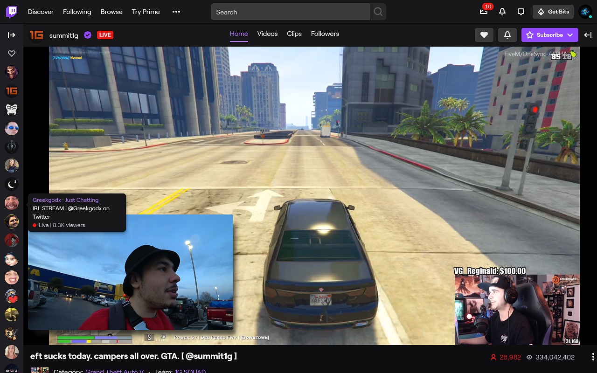

 
 
## **Twitch Previews - a live video or image preview window on Twitch.**
                                                                                     
**Twitch Previews creates a live video or image preview window when hovering the mouse over a streamer card on the navigation sidebar (followed streams list on the side) and in twitch directories.**
 
 

## Download
**Extension is available for Chrome and Firefox: **

**[Chrome Extension](https://chrome.google.com/webstore/detail/twitch-previews/hpmbiinljekjjcjgijnlbmgcmoonclah/
) | [Firefox Add-on](https://addons.mozilla.org/en-US/firefox/addon/twitchpreviews/)**
 
 

## Features:
- Image or live video stream Previews in sidebar & directories.
- Preview resize.
- Auto channel points clicker.
- Chrome only - Auto extend the sidebar to show all online streamers (when sidebar is open).
- Chrome only - A purple search button on the top of the sidebar to find live streamers easily in the sidebar.
- Chrome only - Predictions started and Predictions results notifications when you don't know it's happening (for example if your chat is closed or you are not in the tab or browser) - currently only supports twitch in English.
- Chrome only - Auto page refresh when the main twitch player gets an error (#1000, #2000, #4000).
- Chrome only - Picture In Picture via the button under the viewcount in the list (when in video mode).
- Also supports inverted twitch layout (when chat is on the left and streamers on the right).
 

## How to use:
1. **Add the extension to chrome/firefox.**
    - If you already have a twitch tab opened - refresh it.

2. **Hover your mouse over a streamer on the navigation sidebar or in a twitch directory.**
    - A preview window will appear next to the hovered card.
 
 

* **picture in picture**
    - If you're in video preview mode, a small button will appear under the view count when you hover a streamer - click it and a persistent preview window will appear (using chrome's PIP feature).
    - You can still use the regular previews alongside with PIP.
 

* **Sidebar streamer search**
    - A purple search button on the top of the sidebar to find live streamers easily.
    - Searches within the currently shown streamers so the sidebar will automatically extend to show all live streamers when you start searching.
 

* **Predictions notifications**
    - Predictions started and Predictions results notifications when you don't know it's happening (for example if your chat is closed or you are not in the tab or browser).
    - Works on opened stream tabs in the browser.
    - This feature is currently only for users who have twitch in English.
    - When enabling the feature, you will need to allow notification permissions for twitch.tv (a prompt will show - if not, click on the lock icon on the left of the url and check if it's allowed there).
 

* **Auto page refresh when the main twitch player gets an error (#1000, #2000, #4000)**
    - This feature works when the tab with the player that got an error is currently active.
    - If the player got an error while the tab was not active (in the background or chrome wasn't the active window) the page will automatically refresh when you come back to it.
    - This feature is turned off by default and can be turned on in the extension options.
 

* **Auto bonus channel points clicker**
    - This feature automatically clicks the green channel points redeem button.
    - It also works when chat is closed and when the tab or window is in the background.
    - This feature is turned off by default and can be changed in the extension options.

 
 

- To change any feature setting click the extension at the top bar to open the extension's options menu.
 
 
 
 
 
 
 
 

[privacy policy](https://sites.google.com/view/twitchpreviews-privacy-policy
) | [terms and conditions](https://sites.google.com/view/twitchpreviews-t-a-c/) 
 
© Twitch Previews.