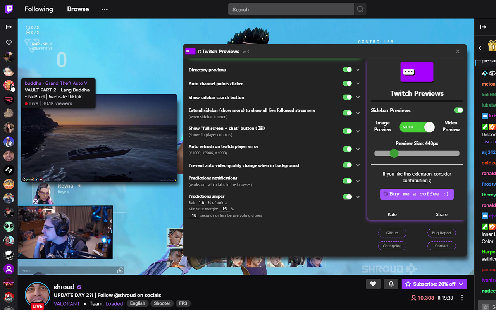

 
 
## **Twitch Previews**
                                                                                     
**Twitch Previews creates a live video or image preview when hovering over a stream on the navigation sidebar (followed streams list on the side) and in twitch directories.**
  
**Check out the features list below for more quality of life improvement features to twitch.**
 
 

## Download
**Twitch Previews is available for all browsers: **

**[Chrome Extension](https://chrome.google.com/webstore/detail/twitch-previews/hpmbiinljekjjcjgijnlbmgcmoonclah/)
 | [Firefox Add-on](https://addons.mozilla.org/en-US/firefox/addon/twitchpreviews/)**
 
* Chromium based browsers can install extensions from the chrome webstore. 
 

## Features:
- Image or live video stream Previews in the sidebar & directories.
- Preview resize & volume control.
- Streaming: See your own live stream thumbnail as seen by viewers on twitch.
- Multi Stream & Multi Chat.
- Transparent / Dynamic Chat Overlay.
- Full Screen With Chat Mode.
- Sidebar Favorite Channels List.
- Sidebar YouTube Channels List.
- Auto Channel Points Clicker.
- Clip Downloader.
- Auto Refresh on player errors (#1000, #2000, #4000).
- Predictions Notifications when you don't know it's happening (for example if your chat is closed or you are not in the tab or browser).
- Predictions Sniper (will participate in predictions for you).
- Prevent Automatic Video Quality Change.
- Seek Streams Using Keyboard Arrow Keys.
- Fast-Forward Stream.
- Chrome-Cast -> Close Tab.
- Screenshot Stream.
- FlashBang Defender.
- Clear Chat Button.
- Native Picture In Picture in current stream (Browser's PIP feature).
- Custom Picture In Picture via the button under the view count in the sidebar (when in video mode).
- Auto Extend the sidebar to show all live streamers (when sidebar is open).
- Sidebar Stream Search: A purple search button at the top of the sidebar to find live streamers easily in the sidebar.
- Hide All Sidebar Sections Except The Followed Channels.
- Mute Auto-Playing Videos In Various Pages.
- Also supports inverted twitch layout (when chat is on the left and streamers on the right).
 

## How to use:
1. **Add the extension to your browser.**
    - If you already have a twitch tab opened - refresh it.

2. **Hover your mouse over a streamer on the sidebar / directories.**
    - A preview will appear next to the hovered stream.
 
 

## Feature Notes:
* **Stream Previews**
    - Live image and video previews when hovering over streams in the sidebar and directories.
        

* **Streaming - See Your Own Live Stream Thumbnail**
    - Shows your own stream's live thumbnail preview, as seen by viewers on Twitch, when hovering over the Twitch logo at the top left.
    - This feature is only active on 'twitch.tv' pages, it's not active in the clips directory or in the dashboard (like clips.twitch.tv).
        

* **Multi Stream & Multi Chat**
    - You can add Multi-Stream and Multi-Chat on the fly to any page you're on directly from the sidebar (if in Video Preview mode) or via the top search bar (if the Multi-Stream feature is enabled).
    - There is also a button that is located next to the stream uptime under the stream.
    - Clicking it will start Multi Stream on a new Twitch tab - so you can still enjoy the benefits of the sidebar and the search function at the top bar.
    - In the new Multi-Stream tab, add a stream from the sidebar or search for a stream at the top Twitch search bar and click the Multi-Stream button in the results to add the stream.
    - You can scroll the page, change background color & transparency, font color, weight, increase/decrease size, fullscreen, drag, resize and minimize the boxes (top bar and bottom right corner of the boxes).
    - If the Auto Channel Points feature is enabled, it will collect points in the chat box.
    - If you enable the 'Sidebar YouTube Channels' feature, you can add your subscribed YouTube channels to the Multi-Stream and use it cross-platform (also supports YouTube chat).
        

* **Full Screen With Chat**
    - The button will show next to the 'theater mode' or 'fullscreen' button in the player controls.
    - Hovering over it will show two options: Full Screen with Custom chat overlay or Default Chat.
    - The Custom chat will automatically position itself over the video to the right and stretch to screen height.
    - You can resize, move it around, align to each side and change styles with the controls at the top of the chat box.
    - The Custom chat's settings (position, size, colors, etc..) will be saved for the current page session.
    - The Custom Chat will spawn back when you return to fullscreen after exiting fullscreen while in mode.
    - Exit the mode by clicking the button in the player controls again or click the close(x) button on the Custom Chat and exit fullscreen.
    - Firefox users - exit the 'Default-Chat' mode by double tapping ESC.
        

* **Sidebar Favorite Channels**
    - A new Favorites list at the top of the sidebar (for your most favorite streamers).
    - Add streams to your favorites list by clicking the Favorites button next to the bell under the stream.
    - The list will show only the currently live streams in your favorites list.
    - Note: the feature relies on the followed channels list, so it will auto-expand (show more) when the sidebar is opened. if it's closed, the list will still populate but will be partial.
    - Note: it might take a few seconds for the list to show or update.
        

* **Sidebar YouTube Channels**
    - A new list at the top of the Twitch sidebar to show your subscribed YouTube channels that are currently live on YouTube.
    - The list data will update every 5 minutes.
    - The list will show only the currently live streams in your favorites list.
    - Supported by the Custom Picture-In-Picture and Multi-Stream & Multi-Chat features so you can use the Multi-Stream cross-platform.
    - You need to be logged in to YouTube on your browser (just go to youtube.com and login if you aren't already).
    - When enabling this feature, you will need to allow the extension to run on "youtube.com" (a prompt will show when enabling) - this is so the extension can fetch the streams from YouTube.
        

* **Auto Channel Points Clicker**
    - This feature automatically clicks the green channel points redeem button.
    - It also works when chat is closed and when the tab or window is in the background.
        

* **Clip Downloader**
    - The button will show in the player controls of clips.
    - When enabling this feature, you will need to allow the extensions to run on "clips.twitch.tv" (a prompt will show when enabling).
        

* **Sidebar Stream Search**
    - A purple search button on the top of the sidebar to find live streamers easily.
    - Searches within the currently shown streamers so the sidebar will automatically extend to show all live streamers when you start searching.
        

* **Sidebar Extend**
    - Auto extends the sidebar to show all live streamers (when sidebar is open).
        

* **Hide All Sidebar Sections Except The Followed Channels**
    - Hides all the other sections in the sidebar except the followed channels.
    - Note: this feature does not affect the 'sidebar favorites' feature, you will still see your favorites and YouTube channels lists.
        

* **Mute Auto-Playing Videos In Various Pages**
    - Mutes the auto-playing video players in various pages.
        

* **Native Picture In Picture**
    - The button will show next to the 'theater mode' button in the player controls.
    - Clicking it will start chrome's Picture In Picture for the current stream.
        

* **Custom Picture in picture**
    - If you're in video preview mode, a small button will appear under the view count when you hover a streamer - click it and a persistent preview window will appear (you can add as many as you like).
        

* **Auto Refresh When The Main Twitch Player Gets An Error (#1000, #2000, #4000)**
    - This feature works when the tab with the player that got an error is currently active.
    - If the player got an error while the tab was not active (in the background or the browser wasn't the active window) the page will automatically refresh when you come back to it.
        

* **Prevent Automatic Video Quality Change**
    - Prevents automatic video quality change when twitch is in the background (when switching tabs / tasks).
    - Prevents 99% of Twitch player errors (#1000, #2000).
    - Prevents that video hang when switching back to the Twitch tab after it was in the background for a while.
        
      

* **Seek Streams Using Keyboard Arrow Keys**
    - Seeks 5 seconds back or forward using the keyboard left/right arrow keys.
    - Note: this feature moves the playback point in the buffer, which is constantly cleared by Twitch, so seeking might sometimes be interrupted.
    - Note: the buffer size varies between 0 seconds to two minutes.
        
      

* **Fast-Forward Stream**
    - Useful if your stream is delayed.
    - The button will show in the player controls next to the 'play/pause' button.
    - Click it to fast-forward the stream to the latest point in the buffer.
        
      

* **Chrome-Cast -> Close Tab**
    - The button will show in the player controls.
    - Click it to start casting on a new tab and then close the new tab without stopping the Chrome-Cast.
    - Everything is done automatically, you just need to select your casting device when prompted.
    - Note: experimental feature, try again if it fails.
        
      

* **Screenshot Stream**
    - The button will show in the player controls.
    - You can capture multiple screenshots and then save only the ones you like.
    - The screenshots are captured at the same resolution as the stream.
        
      

* **FlashBang Defender**
    - For when it's late night and the streamer opens a white screen.
    - Toggles a semi-transparent overlay on top of the stream.
    - The button will show in the player controls.
        
      

* **Clear Chat Button**
    - The button will show under the chat.
    - Clears all the messages in chat.
        
      

* **Predictions Notifications**
    - Predictions started and Predictions results notifications when you don't know it's happening (for example if your chat is closed or you are not in the tab or browser).
    - Works on twitch tabs in the browser.
    - When enabling the feature, you will need to allow notification permissions for twitch.tv (a prompt will show - if not, click on the lock icon on the left of the url and check if it's allowed there).
        

* **Predictions Sniper**
    - The predictions sniper will participate in predictions for you.
    - Works on twitch tabs in the browser.
    - The sniper will choose the prediction option with the most amount of votes received at the time of entry (x seconds before prediction closes).
    - If you have your chat open (no need), you will see the prediction menu for a split second when the sniper is entering a prediction.
    - You can enable the 'Predictions notifications' feature if you want to know what's happening in real-time.
    - If there is already a bet made on the prediction, the sniper will not add more points.
    - To change Sniper settings for individual streams, click the Sniper settings button under the chat.
        
    - Default Settings:
        - Bet % - the percentage of channel points you want the sniper to bet.
        - Max num of points - the maximum amount of points the sniper is allowed to vote with.
        - Min vote margin % - a percentage representation of the minimum required vote margin between the two prediction options for the sniper to participate.
            - For example: option A- 100 votes, option B- 115 votes, vote spread: A-46.51% B-53.49%, vote margin: 6.98% (53.49% - 46.51%). if the minimum vote margin is lower than 6.98%, the sniper will participate in the prediction.
        - Seconds - the amount of seconds the sniper will make a prediction before the prediction closes (min 2s).
            
    - Remember that this is a statistical tool and wins are not guaranteed.
        
    
 
       

 
 

- To change any feature setting click the extension at the top bar to open the extension's options menu.
 
 
 
 
 
 
 
 

[privacy policy](https://sites.google.com/view/twitchpreviews-privacy-policy
) | [terms and conditions](https://sites.google.com/view/twitchpreviews-t-a-c/) 
 
© Twitch Previews.
